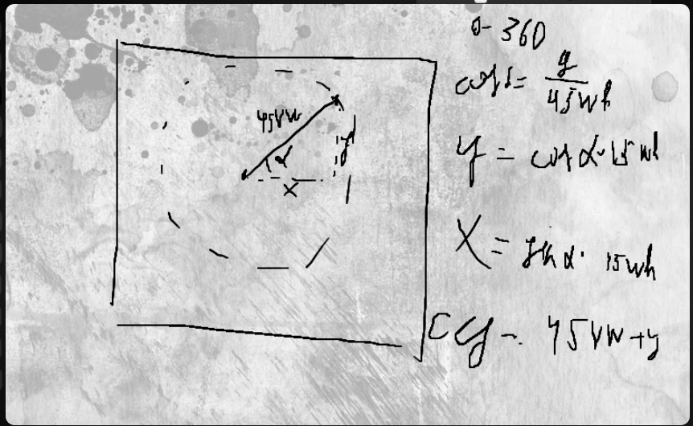

# Description
This project is created just for fun
But there is one important thing that makes me to upload it, I figured out how to use cos and sin.
This is not just a plain animation, this is MATH behind everything!
\

# Project example, this moves around the center point by circular trajectory
<!-- blank line -->
<figure class="video_container">
  <video controls="true" allowfullscreen="true" poster="math.png">
    <source src="video.mp4" type="video/mp4">
  </video>
</figure>
<!-- blank line -->

# The same video but uploaded:
https://user-images.githubusercontent.com/48696470/126881455-6cd6f7da-3257-4e47-b4e7-d01e48f283b4.mp4
